# Application Proposal

## Author

Juan Pablo Guzman Restrepo.

## Project

Mobile Development Project — Peer Assessment App

---

## 1. General Description

**Peer Assessment App** is a mobile application that will be developed in Flutter and will allow the evaluation of students' performance and commitment in collaborative activities within university courses.

The system will facilitate peer assessment in group work by providing tools to manage courses, groups, assessment activities, and result analysis. The application promotes individual responsibility, transparency in collaborative work, and the monitoring of academic performance.

---

## 2. Analyzed References

### Google Classroom

* Course and student management.
* Clear organization of academic activities.
* Simple and intuitive teacher–student interaction flow.

### Moodle

* Structured assessment system.
* Advanced user and role management.
* Detailed performance tracking.

### Peergrade / Peer Assessment Systems

* Structured peer assessment.
* Feedback among students.
* Visualization of results and metrics.

---

## 3. Architecture and Solution Design

### Proposed architecture

The application follows **Clean Architecture** principles to ensure scalability, maintainability, and separation of responsibilities.

**System layers:**

* Presentation Layer: user interface and interaction handling.
* Domain Layer: business logic and system rules.
* Data Layer: external services, storage, and persistence.

### State management

* GetX for state management, navigation, and dependencies.

### System configuration

* Single application with role support.
* Secure authentication.
* Remote data storage.
* Group import from an external platform.

---

## 4. Main Features

### Teacher

* Create and manage courses.
* Invite students through private access or verification.
* Import groups from an external system.
* Create assessment activities.
* Define result visibility (public or private).
* View performance metrics.
* Review detailed results by student and group.

### Student

* Join courses.
* View work group.
* Evaluate classmates (no self-assessment).
* Review assessment results.
* Check activity history.

---

## 5. Evaluation Criteria

Each student is evaluated according to the following criteria:

* Punctuality
* Contributions
* Commitment
* Attitude

### Evaluation scale

| Level | Description       |
| ----- | ----------------- |
| 2.0   | Needs Improvement |
| 3.0   | Adequate          |
| 4.0   | Good              |
| 5.0   | Excellent         |

Self-assessment is not allowed.

---

## 6. System Functional Flow

### General system flow

1. The teacher creates a course.
2. The teacher invites students to the course.
3. The system imports the groups from the external platform.
4. The teacher creates an assessment activity.
5. The teacher defines the duration and visibility of the assessment.
6. Students access the active assessment.
7. Each student evaluates their group members.
8. The system stores and processes the grades.
9. The system calculates averages by activity, group, and student.
10. The results are displayed according to the visibility settings.
11. The teacher analyzes metrics and performance.

### General system flow diagram

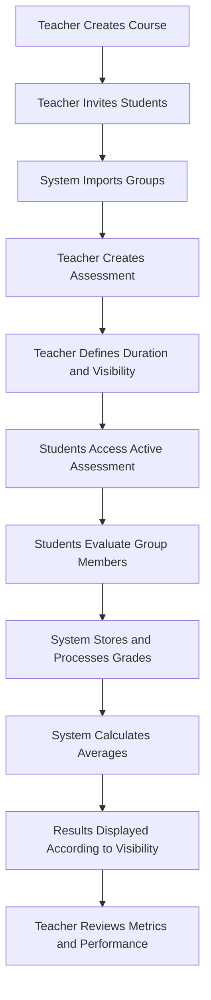

---

### Peer assessment flow (student)

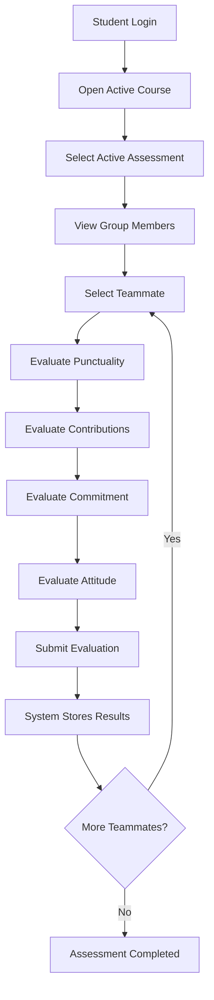

1. The student logs in.

2. Selects the active course.

3. Selects a group member.

5. Evaluates the criteria:

   * Punctuality

* Contributions

* Commitment

* Attitude

6. The system records the results.

---

### Assessment creation flow (teacher)

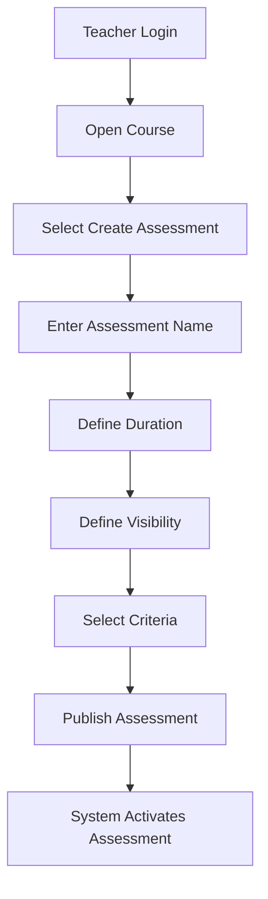

1. The teacher logs in.

2. Selects a course.

3. Defines:

   * name

* duration

* visibility

* criteria

4. Publishes the assessment.

---

### Results visualization flow

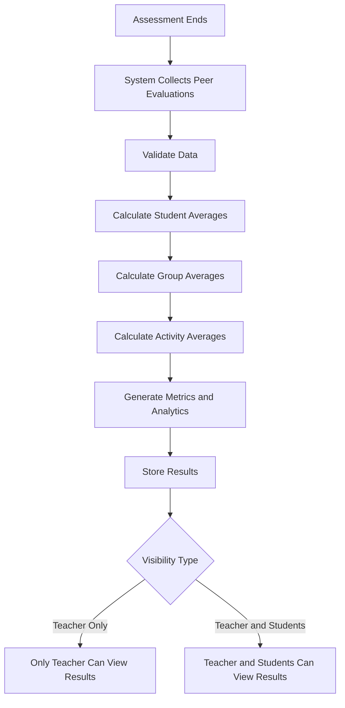

1. The system processes the assessments.
2. Calculates averages.

5. Generates metrics:

   * average by group

* comparison between groups through charts

* Work completion

* Performance trends

5. Displays results according to the configuration:

   * teacher only

* teacher and students

---

## 7. UX/UI Design

The application design prioritizes:

* Usability and visual clarity.
* Intuitive navigation.
* Immediate user feedback.
* Clear visualization of metrics.
* Role-based adaptable interface.
* Accessibility and visual consistency.

The system includes:

* Authentication screens.
* User dashboard.
* Guided assessment flow.
* Course management.
* Results and analytics panel.

### Authentication flow

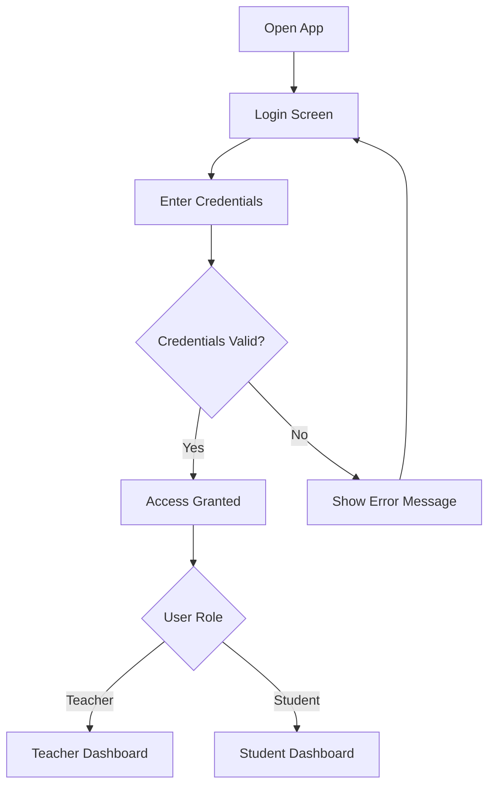

### Dashboard flow

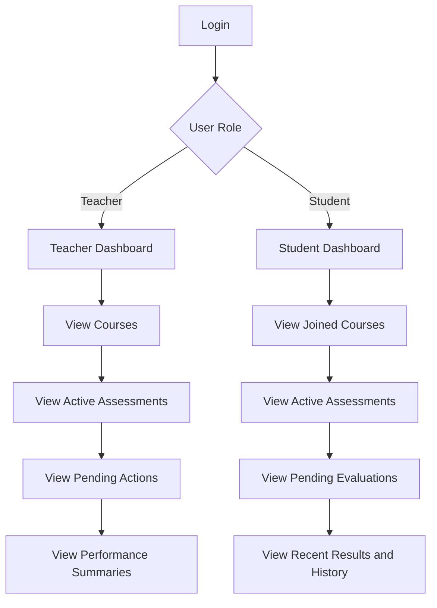

---

## 8. Proposal Justification

* Improves individual responsibility.
* Enables objective evaluation of teamwork.
* Facilitates academic performance analysis.
* Reduces bias in group assessments.
* Provides quantifiable feedback.

---

## 9. Figma Prototype

Prototype link:
[https://www.figma.com/make/fUff3akO7fkAHo6xS4PnOS/Peer-Assessment-App-UI-UX?t=na7wTLLx4yijH20F-1](https://www.figma.com/make/fUff3akO7fkAHo6xS4PnOS/Peer-Assessment-App-UI-UX?t=na7wTLLx4yijH20F-1)

The prototype includes:

* Authentication flow.
* User dashboard.
* Peer assessment.
* Course management.
* Results panel.

---

## 10. Technologies

* Flutter
* GetX
* Clean Architecture
* Authentication and remote storage services

---

## 11. Additional User Flows

### Teacher flow — Create and manage course

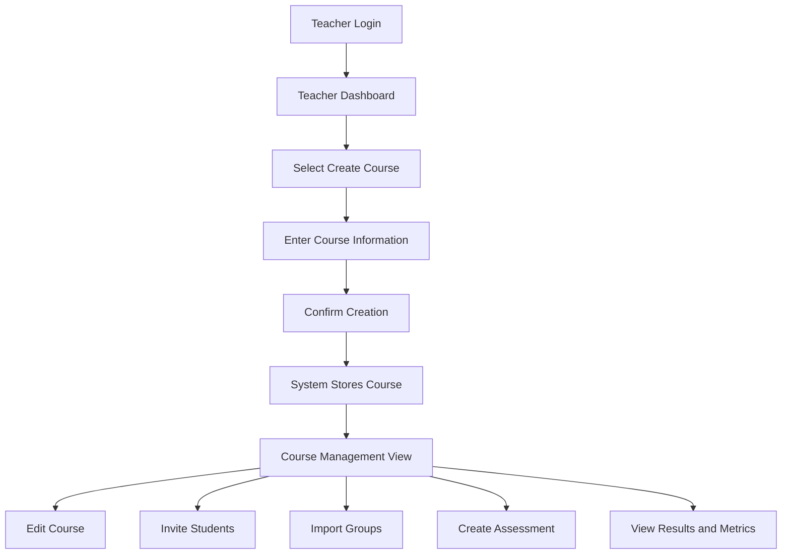

### Teacher flow — Invite students

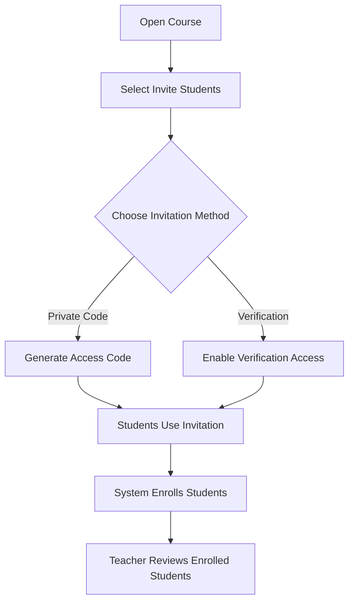

### Teacher flow — Import groups

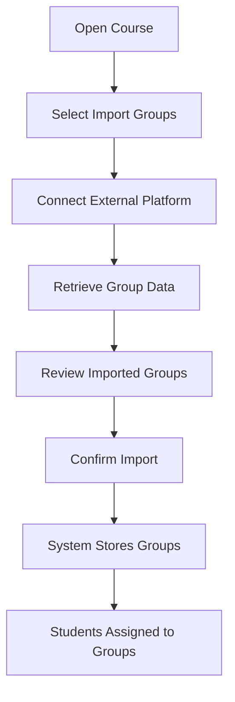

### Student flow — Join course

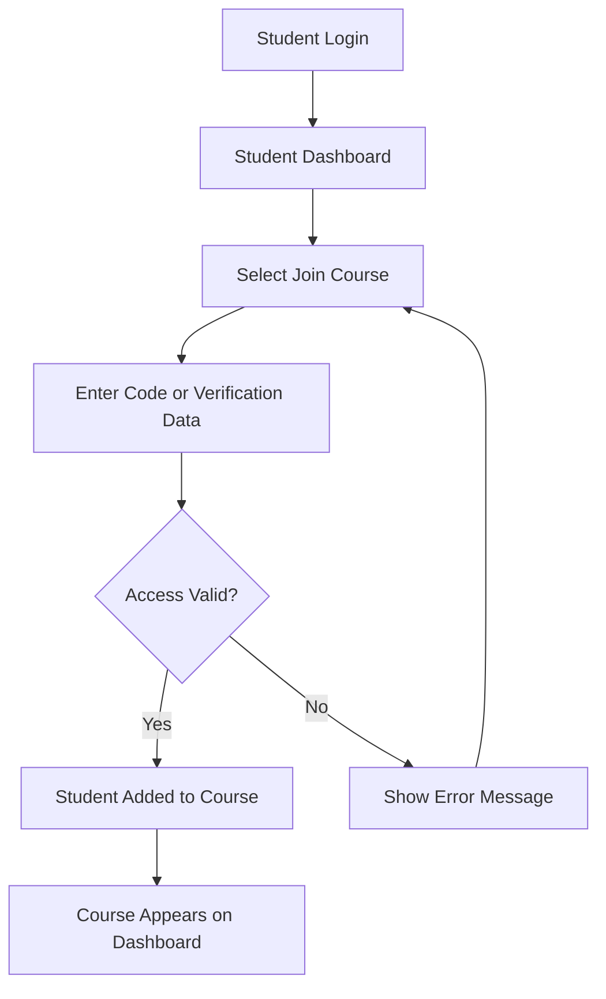

### Rule flow — No self-assessment

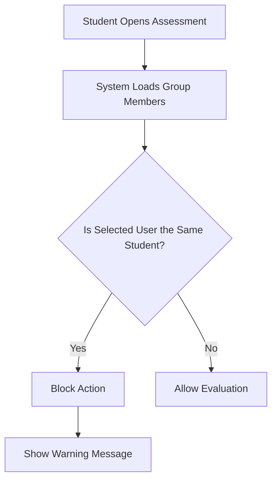

### Student flow — View results

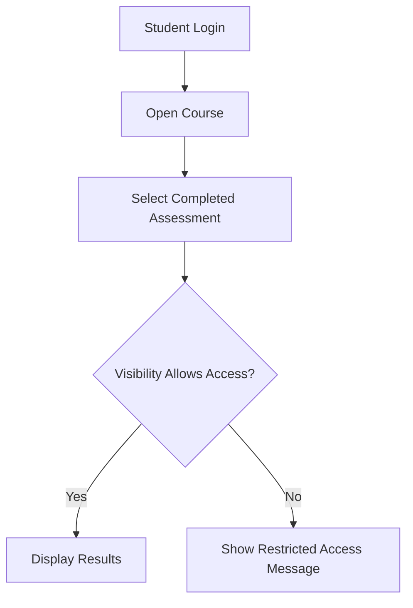

### Activity history flow

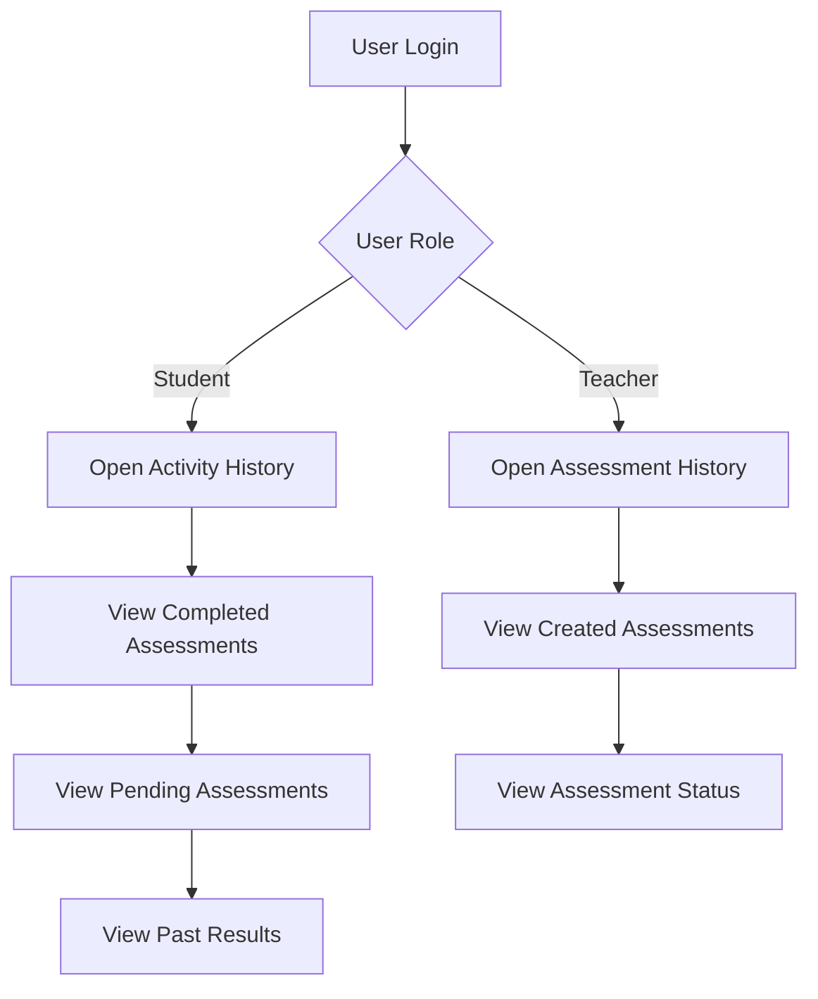

Un detalle: en tu numeración original hay un par de saltos, por ejemplo aparece el paso 5 después del 3 en algunos flujos. Lo dejé igual en varias partes para no alterar demasiado tu estructura visual. Si quieres, te lo corrijo para que quede completamente pulido y listo para entrega.

* Clean Architecture
